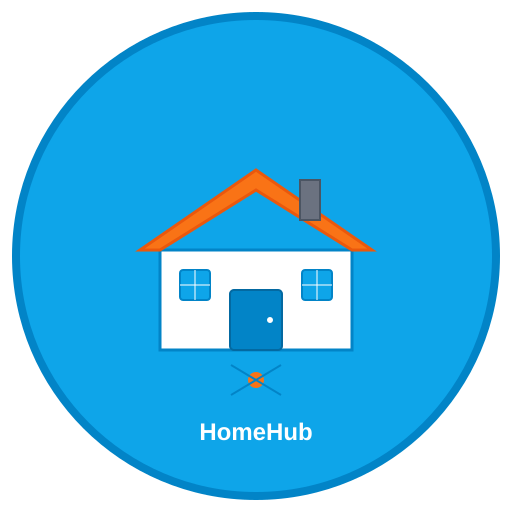

# HomeHub

A modern Progressive Web App (PWA) for smart home management, built with Next.js, React, and TypeScript.



## Features

### 🏠 Smart Home Management
- Control all your smart devices from one dashboard
- Set up automation rules and workflows
- Monitor energy usage and security systems

### 📱 Progressive Web App
- **Installable**: Add to home screen on any device
- **Offline Support**: Works without internet connection
- **Native Experience**: App-like feel on mobile and desktop
- **Fast Loading**: Optimized performance with service workers

### 🎯 Core Functionality
- Time tracking and productivity tools
- Expense management and budgeting
- Family profile management
- Security and privacy focused

## Installation

### As a Web App
1. Visit the app in your browser
2. Look for the "Install App" button or browser's install prompt
3. Click install to add HomeHub to your home screen

### Development Setup
#### Option A: Dev Container (recommended)

1. Open this repository in VS Code.
2. Run "Dev Containers: Reopen in Container".
3. Wait for post-create to complete. It will:
    - install dependencies with `pnpm install`
    - generate Prisma client with `pnpm db:gen`

Then run the app:

```sh
pnpm dev
```

#### Option B: Local Setup (without dev container)

```sh
# Clone the repository
git clone <your-repo-url>
cd home-hub

# Install dependencies
pnpm install

# Generate Prisma client
pnpm db:gen

# Start development server
pnpm dev
```

#### Environment Setup

- Add environment variables to `.env` (use `.env.sample` as reference)
- Google Auth: https://console.cloud.google.com/apis/credentials
- GitHub Auth: https://github.com/settings/apps

#### Database

If you are not using the dev container-managed services, start local services manually:

```sh
docker compose up -d
```

Open Prisma Studio:

```sh
pnpm db:studio
```

Prisma Studio runs on `http://localhost:5555` by default.

#### Common Development Commands

```sh
# Start development server
pnpm dev

# Generate Prisma client
pnpm db:gen

# Sync schema to database
pnpm db:push

# Open Prisma Studio
pnpm db:studio
```

#### Production Build

```sh
# Build for production (includes PWA features)
pnpm run build

# Start production server
pnpm run start
```

## PWA Features

### Service Worker
The app automatically generates a service worker that:
- Caches static assets for offline use
- Implements network-first strategy for dynamic content
- Provides background sync capabilities

### Manifest
The web app manifest (`/public/manifest.json`) enables:
- Custom app icon and branding
- Standalone display mode
- Theme color customization
- Installation shortcuts

### Installation
Users can install HomeHub as a native app by:
1. Using the browser's install prompt
2. Clicking the "Install App" button in the UI
3. Adding to home screen on mobile devices

## Browser Support

HomeHub PWA works on:
- ✅ Chrome (Desktop & Mobile)
- ✅ Firefox (Desktop & Mobile)
- ✅ Safari (Desktop & Mobile)
- ✅ Edge (Desktop & Mobile)

## File Structure

```
public/
├── logo.svg              # Main app logo
├── icon-192.svg          # PWA icon (192x192)
├── icon-512.svg          # PWA icon (512x512)
├── manifest.json         # Web app manifest
└── browserconfig.xml     # Windows tile configuration

src/
├── app/
│   ├── layout.tsx        # Root layout with PWA meta tags
│   └── page.tsx          # Home page with install button
├── components/
│   └── install-pwa-button.tsx  # PWA install component
└── hooks/
    └── use-install-pwa.ts       # PWA installation hook
```

## Development Notes

- PWA features are disabled in development mode for faster iteration
- Service worker and offline capabilities are only active in production builds
- Use `pnpm run build && pnpm run start` to test PWA features locally

### Authentication Bypass for Development

For development convenience, you can bypass the authentication flow by setting the `BYPASS_AUTH` environment variable to `"true"` in your `.env.local` file:

```bash
# .env.local
BYPASS_AUTH="true"
```

When enabled, the app will automatically inject a test user session with the following details:
- **Name**: Hareesh
- **Email**: hareeshbabu82ns@gmail.com
- **Avatar**: GitHub profile image
- **ID**: 687aafec250a439b85417a3d

This allows you to:
- Skip the OAuth login flow during development
- Test authenticated features immediately
- Avoid rate limits from OAuth providers
- Work offline without internet connection

**Note**: This bypass only works when `NODE_ENV` is set to "development" and should never be enabled in production.

## Deployment

The app can be deployed to any hosting platform that supports Next.js:
- Vercel (recommended)
- Netlify
- Docker containers
- Static hosting with `output: 'export'`

### Docker Deployment

```sh
# Build the image
docker build -t homehub .

# Run the container
docker run -p 3000:3000 homehub
```

### Environment Variables

Make sure to set the following environment variables in production:
- `NEXTAUTH_SECRET`
- `NEXTAUTH_URL`
- Database connection string
- OAuth provider credentials

## Contributing

1. Fork the repository
2. Create a feature branch
3. Make your changes
4. Test PWA functionality in production build
5. Submit a pull request

## License

This project is licensed under the MIT License.

---

## Legacy Setup Notes (Coder Environment)

```sh
docker ps
# instance id for 'coder-hareesh-ws-test' is coder-8a3d37ef-75df-49f0-9ce6-9a451ac1ab42
docker inspect coder-hareesh-ws-test

# go to mount folder
cd /var/lib/docker/volumes/coder-8a3d37ef-75df-49f0-9ce6-9a451ac1ab42-home/_data/dev/home-hub/data
mkdir mnt_books

mount -t cifs //192.168.86.10/books /var/lib/docker/volumes/coder-8a3d37ef-75df-49f0-9ce6-9a451ac1ab42-home/_data/dev/home-hub/data/mnt_books -o username=hareesh,password=<XXX>,rw,vers=2.1

mount -t cifs //192.168.86.10/books/Edu/Telugu/project-chalam-telugu-books-collection /var/lib/docker/volumes/coder-8a3d37ef-75df-49f0-9ce6-9a451ac1ab42-home/_data/dev/home-hub/data/mnt_books -o username=hareesh,password=<XXX>,rw,vers=2.1

umount /var/lib/docker/volumes/coder-8a3d37ef-75df-49f0-9ce6-9a451ac1ab42-home/_data/dev/home-hub/data/mnt_books
```
